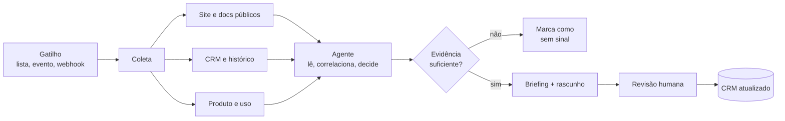

<!-- slide -->
## O pipeline

<!-- /slide -->

Três detalhes desse desenho importam mais do que parecem.

O primeiro é o losango. Um pipeline que sempre produz saída é um pipeline que inventa. A
decisão explícita de não ter encontrado sinal suficiente é o que separa um sistema confiável
de um gerador de plausibilidade. Na prática, uma fração relevante das contas deve sair por ali
— e isso é um bom sinal, não um defeito.

O segundo é a revisão humana antes do envio, não depois. O vendedor deixa de produzir o
contexto e passa a julgá-lo, que é uma tarefa muito mais rápida e muito mais alinhada com o
que ele sabe fazer bem.

O terceiro é a seta que volta para o CRM. Sem ela, o trabalho invisível é feito de novo na
próxima interação, por outra pessoa, do zero. O ganho composto de um sistema desses não vem
da primeira execução; vem de a segunda já começar com contexto.
