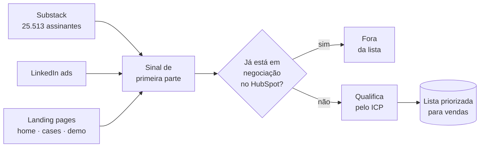

# 12 de agosto

<!-- slide -->
## A descoberta

- Newsletter no Substack desde **setembro de 2024**
- Mais de um post por mês desde **junho de 2025**
- **25.513 assinantes**
- E o time de vendas começava a semana com uma **lista fria**
<!-- /slide -->

Foi isso que a Sheida viu no fim de julho, e é a coisa mais desconfortável desta palestra.

Nós tínhamos construído, ao longo de dois anos, uma audiência de vinte e cinco mil pessoas
interessadas em IA aplicada a e-commerce — ou seja, exatamente o nosso ICP, se cadastrando
voluntariamente, toda semana. Parte dessas pessoas clicava no link, chegava na página de agendar
demo... e não agendava.

Enquanto isso, na segunda-feira, as duas pessoas de vendas abriam uma lista de empresas que nunca
tinham ouvido falar da Ground.

Não é falta de ferramenta e não é falta de dado. O sinal existia, era nosso, estava pago e ninguém
olhava. **Esse é o trabalho invisível do inbound: o dado já é seu, e mesmo assim custa caro
alguém juntar.**

<!-- slide -->
## O que o Command Center faz

<!-- /slide -->

<!-- slide:center -->
Vamos ver o Command Center rodando.

# Demo 2
<!-- /slide -->

São quatro passos, e nenhum deles é sofisticado.

**Um: puxar todo sinal de primeira parte para um lugar.** Quem visitou uma página que importa —
home, página de case, página de agendar demo. Quem completou o funil e quem parou no meio. Se
alguém já foi avisado ou já falou com essa pessoa.

**Dois: cruzar com o HubSpot.** Tirar da lista quem já está em negociação ativa. Isso parece
detalhe e é o que faz o time confiar na lista: ninguém quer ser a terceira pessoa da empresa a
abordar o mesmo contato na mesma semana.

**Três: qualificar.** As mesmas três condições da seção 1. O critério objetivo aparecendo pela
terceira vez.

**Quatro: notificar.** A lista chega para quem vai trabalhar nela, sem ninguém pedir.

<!-- slide -->
## Três semanas

| Semana | Demos agendadas |
| --- | --- |
| 1 | **0** |
| 2 | **3** |
| 3 | **7** — e é esta semana |
<!-- /slide -->

Duas ressalvas, e as duas eu prefiro fazer antes de alguém fazer.

**Três semanas não são uma tendência.** É o começo de uma. A semana 1 deu zero, e eu deixo o zero
no slide de propósito: é o número que prova que os outros dois não são vitrine. Não tem semana 4
ainda, e eu não vou desenhar uma linha pontilhada dizendo para onde isso vai.

**O Command Center não criou o sinal.** O sinal já estava crescendo nesse período por conta de
outras coisas. O que o software fez foi **parar de desperdiçar** o sinal que já existia. É uma
contribuição menor de se dizer e mais honesta.

<!-- slide -->
## Ponto e curva

| A skill | O software |
| --- | --- |
| 8 demos, uma vez | 0, depois 3, depois 7 |
| Alguém decidiu rodar | Ninguém decide nada |
| Custa atenção a cada rodada | Custou atenção uma vez |
| Entrega um **ponto** | Entrega uma **curva** |
<!-- /slide -->

Aqui as duas metades da palestra encostam uma na outra.

A skill do Cosmoprof entregou mais em números absolutos: 8 demos contra 10. E ela acabou. Para
ter os próximos 8, alguém precisa decidir rodar de novo, e a rodada custa a mesma atenção que
custou na primeira vez.

O Command Center entregou menos e não acabou. Na segunda-feira que vem tem lista, sem ninguém
decidir. É esse o formato que a década de SaaS descobriu e que a gente estava aplicando ao produto
sem aplicar ao próprio trabalho.

<!-- slide -->
## Três semanas de prioridade zero

- Construído com **Claude Code**
- **Uma pessoa**, meu P0 desde 12 de agosto
- Sem time de dados, sem time de front-end
<!-- /slide -->

Não vou fazer tour de código, porque o interessante não é o código.

O interessante é o que teria acontecido com esse projeto há dois anos. Ele exigiria um engenheiro
de dados para as integrações, alguém de front-end para a interface e algumas semanas de duas
pessoas. E aí ele entraria na fila de priorização contra o produto que o cliente paga — e
**perderia**. Ferramenta interna sempre perde essa briga, em toda empresa, sempre.

<!-- slide:center -->
A IA não deixou o software mais rápido de escrever.

# Ela deixou barato o suficiente para não competir com o roadmap
<!-- /slide -->

Essa é a frase que eu levaria embora se eu estivesse na plateia.

O que mudou não foi a velocidade de digitar código. Foi o **limiar** do que vale a pena construir
sendo uma empresa pequena. Um monte de software que antes era obviamente caro demais para o
retorno agora fica do lado certo dessa linha — e a maior parte desse software é exatamente o tipo
de coisa de que estamos falando aqui: ferramenta interna, sem cliente pagante, que só faz o time
parar de fazer trabalho invisível.

Sem IA, o Growth Command Center não existiria. Não porque seria impossível, mas porque nunca teria
sido priorizado.
