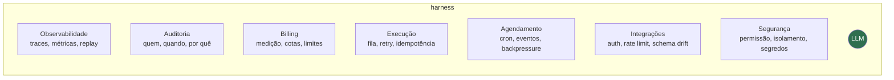

<!-- slide -->
## O que de fato foi construído

<!-- /slide -->

Esse desenho é a palestra inteira em uma imagem. O círculo no meio é a parte que dá nome ao
produto e a que menos código consome.

Vale insistir em uma distinção: o harness não é infraestrutura genérica que se resolve
comprando um PaaS. Cada uma dessas caixas tem uma exigência específica que vem do fato de o
componente central ser não determinístico e caro.

Observabilidade normal registra o que aconteceu; aqui é preciso registrar por que uma decisão
foi tomada, com qual contexto, e conseguir reproduzir aquilo. Billing normal conta requisições;
aqui a unidade de custo varia por execução em uma ordem de grandeza. Execução normal assume que
retry é seguro; aqui uma repetição pode enviar o mesmo e-mail duas vezes.

O harness é infraestrutura clássica com requisitos torcidos por uma peça imprevisível no meio.
