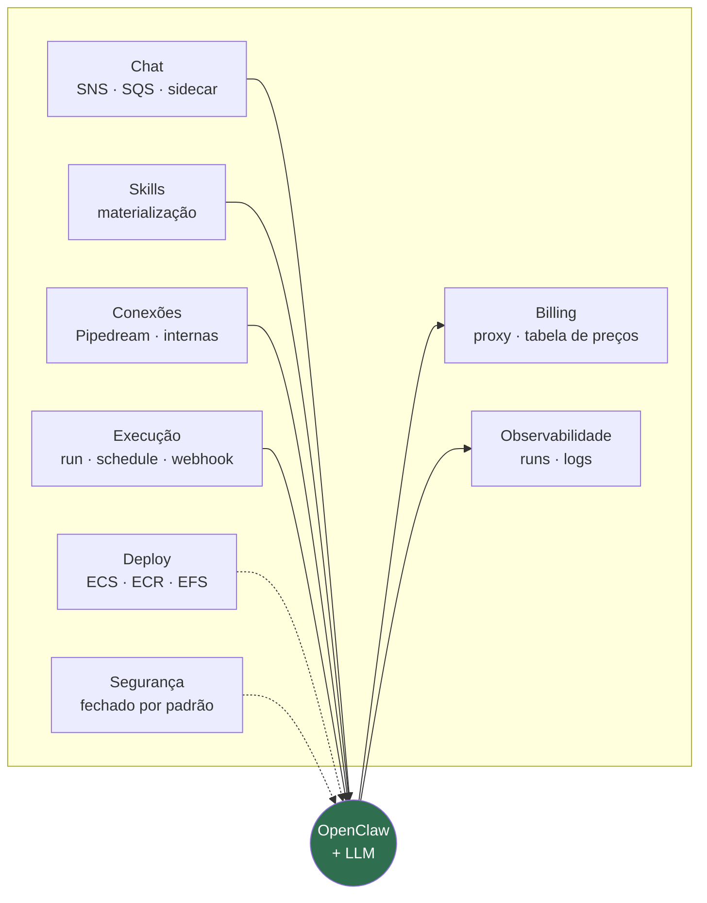

<!-- slide -->
## O que de fato foi construído

<!-- /slide -->

Esse desenho é a palestra inteira em uma imagem. O círculo é o agente propriamente dito — o
OpenClaw com um modelo atrás. Tudo em volta é o que tivemos que construir para que ele pudesse
ser vendido como produto, e a ordem das caixas é a ordem em que vamos percorrer.

Vale insistir em uma distinção: o harness não é infraestrutura genérica que se resolve comprando
um PaaS. Cada caixa tem uma exigência específica que vem do fato de o componente central ser
**não determinístico**, **caro por chamada** e **influenciável pelo texto que lê**.

Observabilidade normal registra o que aconteceu; aqui é preciso registrar o que o agente estava
tentando fazer em cada passo de uma run. Billing normal conta requisições; aqui a unidade de
custo varia por execução em uma ordem de grandeza. Segurança normal protege o perímetro; aqui o
próprio agente é um usuário com credenciais e precisa ser tratado como tal.
