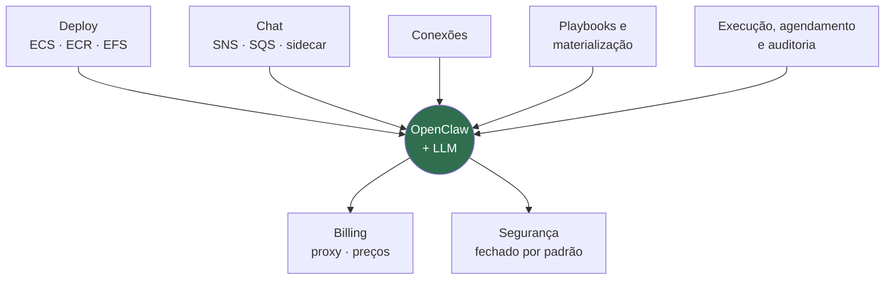
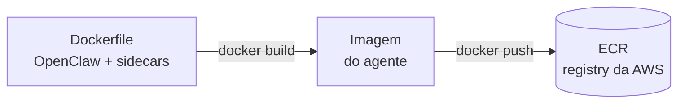
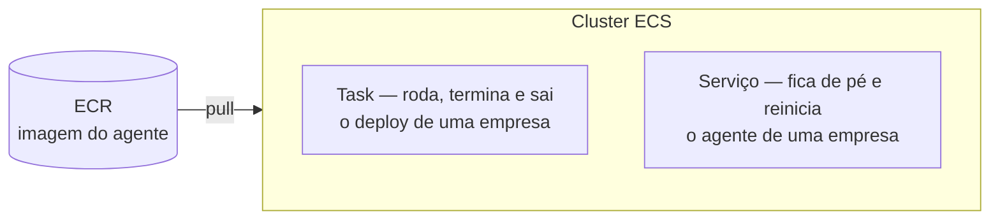
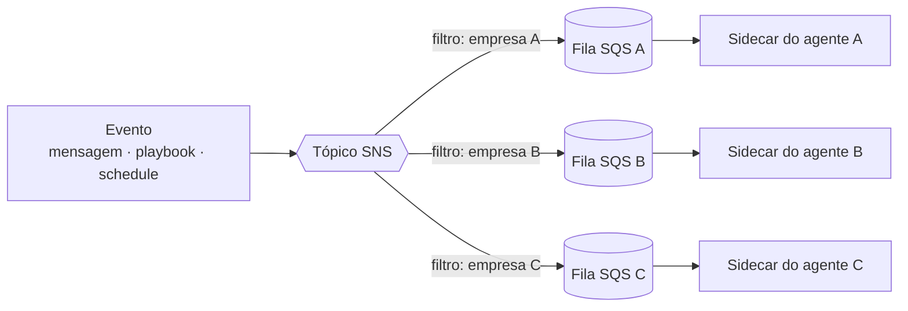

<!-- slide:capitulo -->
# O harness, peça por peça
<!-- /slide -->

<!-- slide -->
## O que de fato foi construído

<!-- /slide -->

Esse desenho é a palestra inteira em uma imagem. O círculo é o agente propriamente dito — o
OpenClaw com um modelo atrás. Tudo em volta é o que tivemos que construir para que ele pudesse
ser vendido como produto, e a ordem das caixas é a ordem em que vamos percorrer.

Vale insistir em uma distinção: o harness não é infraestrutura genérica que se resolve comprando
um PaaS. Cada caixa tem uma exigência específica que vem do fato de o componente central ser
**não determinístico**, **caro por chamada** e **influenciável pelo texto que lê**.

Auditoria normal registra o que aconteceu; aqui é preciso registrar o que o agente estava
tentando fazer em cada passo de uma run — e é por isso que o log não tem caixa própria no
desenho: ele nasce dentro da execução, escrito pelo próprio playbook. Billing normal conta
requisições; aqui a unidade de custo varia por execução em uma ordem de grandeza. Segurança
normal protege o perímetro; aqui o próprio agente é um usuário com credenciais e precisa ser
tratado como tal.

<!-- slide:capitulo -->
# O que usamos para construir
<!-- /slide -->

O que usamos para construir é deliberadamente banal: serviço gerenciado, nada exótico. A
dificuldade nunca esteve aqui — mas vale mostrar as três peças, porque tudo o que vem depois
se apoia nelas.

<!-- slide -->
## Docker + ECR: uma imagem para a frota

*A mesma imagem para todas as empresas. O que muda é configuração.*
<!-- /slide -->

Um `Dockerfile` descreve o agente: o OpenClaw, os sidecars e as dependências. Ele é compilado em
uma **imagem** e publicado no **ECR**, o registry da própria AWS. Nenhuma empresa tem imagem
própria; a diferença entre elas mora nas variáveis de ambiente e no disco, nunca no build.

<!-- slide -->
## ECS: a mesma imagem, task ou serviço

<!-- /slide -->

O ECS baixa essa imagem do ECR e a executa de duas formas. Como **task**, quando o trabalho tem
fim: o deploy de uma empresa roda, provisiona, termina e sai. Como **serviço**, quando o processo
precisa ficar de pé e ser reiniciado se cair: é assim que vive o agente de cada empresa.

<!-- slide -->
## SNS + SQS: uma fila por empresa

<!-- /slide -->

Todo evento entra por um **tópico SNS** único. Cada empresa tem uma **fila SQS** inscrita nesse
tópico, com um filtro pelo seu id, e o sidecar do agente daquela empresa é o único consumidor da
sua fila. O produtor não sabe quantos agentes existem, e um agente fora do ar não perde mensagem:
ela espera na fila.
