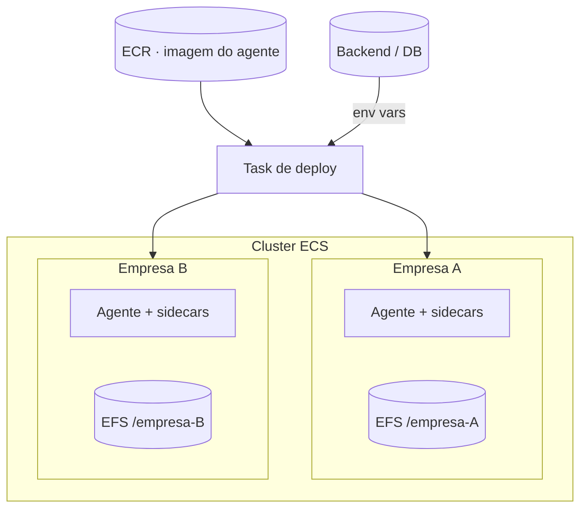
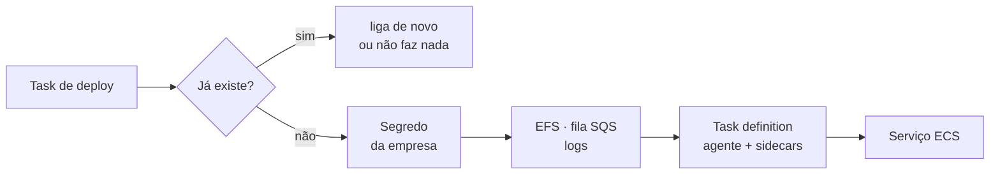

<!-- slide:capitulo -->
# Deploy
<!-- /slide -->

<!-- slide -->
## Um agente por empresa

<!-- /slide -->

Todos os agentes rodam no mesmo cluster ECS, mas **cada serviço roda o agente de uma
empresa só**. A decisão foi de isolamento, não de escala: o estado do agente, as
credenciais das conexões e as skills são de uma empresa, e a forma mais barata de garantir que
nunca vazem para outra é não compartilhar processo.

## Estado em `.md` precisa de disco

- O OpenClaw guarda memória, configuração e skills em **arquivos Markdown**
- Container é efêmero. Redeploy = perde tudo.
- Um **EFS** para a frota, com um **access point por empresa** montado no agente
- Redeploy troca a imagem; o diretório da empresa continua lá

Aqui está uma das exigências torcidas pelo componente central. Um serviço stateless comum não
liga para redeploy. O OpenClaw, por desenho, é *stateful em arquivos*: memória de longo prazo,
preferências, skills instaladas — tudo em `.md` no disco. Sem um volume persistente, cada deploy
nosso apagaria a memória do agente do cliente.

A solução é a mais antiga possível: um disco. É um único EFS para a frota inteira, mas cada
empresa entra nele por um *access point* próprio, com raiz em `/{id-da-empresa}`, tráfego
cifrado e autorização por IAM. O container monta isso em `/efs` e nunca enxerga o diretório de
outra empresa; o deploy troca a imagem sem tocar no volume. O que é "do OpenClaw" vive no
disco; o que é nosso vive no banco — e essa fronteira reaparece em cada peça seguinte.

<!-- slide -->
## O deploy é uma task

<!-- /slide -->

O agente é uma **imagem Docker no ECR**, a mesma para todas as empresas. O que muda entre elas é
**configuração**, nunca imagem — o 12-factor de sempre. A task de deploy é o único lugar que sabe
montar o ambiente de uma empresa, e ela é idempotente: rodar de novo em uma empresa que já está
no ar não faz nada; em uma que foi desligada, só religa.

Quando é provisionamento de verdade, a lista é comprida — e o tamanho dela é o argumento. O
segredo da empresa é remontado a partir de um segredo compartilhado da frota mais as chaves de
cada conexão; nasce um access point de EFS, uma fila SQS com DLQ inscrita no tópico SNS e filtrada
pelo id da empresa, um log group, uma task definition com o agente e seus sidecars e, no fim, o
serviço no ECS. Nada disso é sobre IA. É provisionamento de tenant, e já existia com esse nome
muito antes de existir agente.

A próxima seção responde à caixa que ficou sem explicação no diagrama: os **sidecars** ao lado
do agente em cada serviço. Com a casa construída, falta mostrar como uma mensagem entra nela.
