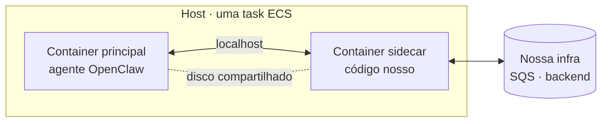
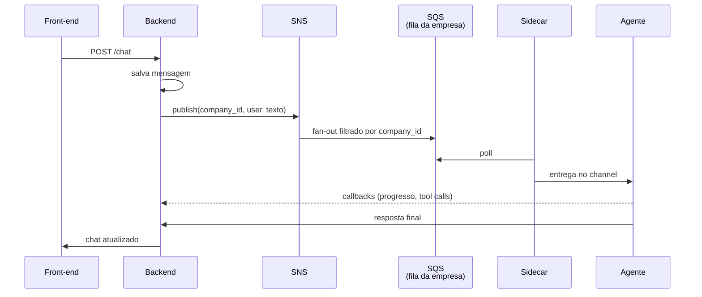

<!-- slide:capitulo -->
# Chat
<!-- /slide -->

## Regra zero: o agente é fechado para o mundo

- Nenhum endpoint público. Nenhuma porta exposta.
- Toda mensagem entra por um **channel** nosso: mensagem + metadados (empresa, usuário)
- O agente não sabe o que é HTTP de cliente. Ele só lê uma fila.

O OpenClaw tem o conceito de *channel*: a porta por onde mensagens entram (Slack, WhatsApp,
Telegram…). Nós criamos o nosso. Ele não escuta em nenhuma porta pública — é um consumidor de
fila. Isso resolve de uma vez autenticação, isolamento entre empresas e a superfície de ataque:
o agente literalmente não tem como receber uma mensagem que não veio do nosso backend.

<!-- slide:image image=assets/chat-ui.png backgroundSize=contain -->
<!-- /slide -->

<!-- slide -->
## Dois containers, um host

<!-- /slide -->

<!-- slide -->
## Conheçam o sidecar

<!-- /slide -->

<!-- slide -->
## Dois containers, um host

Um **segundo container**, no mesmo host e com o mesmo ciclo de vida do agente, que faz o que o
agente não deveria fazer:

- **Fala com a nossa infra** — SQS, backend. O agente não fala.
- **Guarda as credenciais** que o agente não precisa ter
- **Conversa com o agente** por `localhost` ou pelo disco compartilhado
- **É trocado sem mexer** na imagem do agente

***

*O agente fica burro de propósito. O sidecar é quem conhece a casa.*
<!-- /slide -->

Esse é o padrão que vai se repetir na palestra inteira. O OpenClaw é código de terceiros, que
evolui rápido e que não queremos manter um fork. Toda vez que precisamos de um comportamento
que é nosso — consumir fila, sincronizar playbooks, medir tokens — colocamos um processo ao lado,
no mesmo serviço, falando com o agente por localhost ou pelo sistema de arquivos.

O padrão tem nome e página de documentação há uma década: *sidecar*, o mesmo que o Envoy usa em
malhas de serviço ou que agentes de log usam para ler stdout de um container vizinho. Nada aqui
foi inventado; foi reaproveitado.

<!-- slide -->
## O caminho de uma mensagem

<!-- /slide -->

O front-end faz um POST para o backend. O backend persiste a mensagem e publica em um tópico
SNS. Cada agente tem **a sua própria fila SQS**, inscrita no tópico com uma *filter policy* pelo
id da empresa. É o fan-out clássico — a mesma mensagem nunca chega a dois agentes.

Do lado do agente, no mesmo serviço ECS, um processo separado fica consumindo a fila e entregando
cada mensagem ao channel do OpenClaw. Quando o agente termina a tarefa, ele (e os callbacks
intermediários) chama um endpoint no backend para atualizar o chat. O chat vive no banco de
dados, não no agente.
