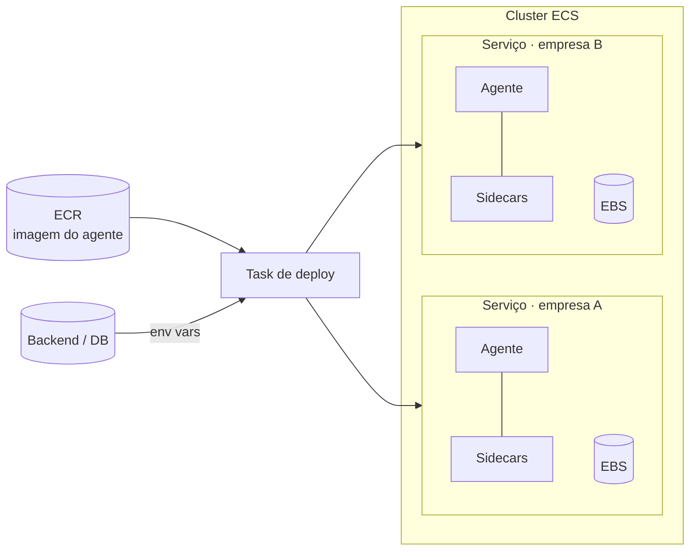

<!-- slide -->
## Um serviço por empresa

<!-- /slide -->

Todos os agentes rodam no mesmo cluster ECS, mas **cada instância do serviço roda para uma
empresa diferente**. A decisão foi de isolamento, não de escala: o estado do agente, as
credenciais das conexões e as skills são de uma empresa, e a forma mais barata de garantir que
nunca vazem para outra é não compartilhar processo.

<!-- slide -->
## O deploy é uma task

1. O agente é uma **imagem Docker no ECR** — a mesma para todas as empresas
2. Uma **task ECS de deployment** prepara as variáveis de ambiente daquela empresa
3. A task injeta as variáveis e sobe (ou atualiza) o serviço
4. O que muda entre empresas é **configuração**, nunca imagem
<!-- /slide -->

Isso é o 12-factor de sempre: uma imagem, muitas configurações. A task de deploy é o único lugar
que sabe montar o ambiente de uma empresa — chaves das conexões, ids das filas, endpoints do
backend, configuração do proxy de billing que vamos ver adiante. O agente recebe tudo pronto.

<!-- slide -->
## Estado em `.md` precisa de disco

- O OpenClaw guarda memória, configuração e skills em **arquivos Markdown**
- Container é efêmero. Redeploy = perde tudo.
- Cada serviço tem o seu **volume EBS** montado no agente
- Redeploy troca a imagem; o volume continua lá
<!-- /slide -->

Aqui está uma das exigências torcidas pelo componente central. Um serviço stateless comum não
liga para redeploy. O OpenClaw, por desenho, é *stateful em arquivos*: memória de longo prazo,
preferências, skills instaladas — tudo em `.md` no disco. Sem um volume persistente, cada deploy
nosso apagaria a memória do agente do cliente.

A solução é a mais antiga possível: um disco. O ECS integra nativamente com EBS desde 2024; cada
serviço tem o seu, e o deploy troca a imagem sem tocar no volume. O que é "do OpenClaw" vive no
disco; o que é nosso vive no banco — e a próxima seção é exatamente sobre essa fronteira.
