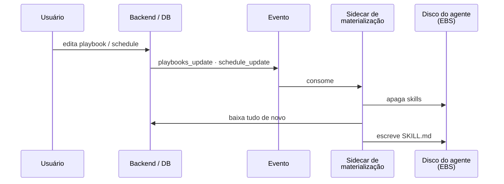

<!-- slide -->
## Skill é da empresa, não do usuário

- Um playbook criado por uma pessoa fica disponível para **toda a empresa**
- O agente é usado **em público**, não em janela privada
- O que uma pessoa ensina, todo mundo passa a poder executar

***

*"A skill que alguém escreveu para ensinar a River sobre o data warehouse de checkout é reaproveitada por doze outros times."* — Tobi Lütke, maio de 2026
<!-- /slide -->

A decisão de produto mais importante do agente da Ground não foi técnica: playbooks pertencem à
empresa. Quando uma pessoa do time de marketing ensina o agente a montar o relatório semanal de
campanhas, essa skill aparece para o time inteiro. O agente não é um assistente pessoal; é um
funcionário que aprende com todo mundo e trabalha para todo mundo.

A referência que nos deu vocabulário para isso é o **River**, o agente da Shopify que vive no
Slack deles. Tobi Lütke publicou em maio de 2026 um texto chamado *Learning on the Shop floor*
descrevendo a restrição central: a River **não responde a mensagens diretas**. Ela educadamente
sugere criar um canal público. Toda conversa fica pesquisável, qualquer pessoa pode entrar, e — a
parte que importa — as skills e instruções que um time escreve ficam disponíveis para os outros.

<!-- slide -->
## O argumento do River

> "ChatGPT é uma janela privada. Claude é uma janela privada. Cursor fica entre você e a IDE. Nós tomamos a decisão oposta."

> "Não retreinamos um modelo. Não trocamos de modelo. Uma melhora de 36% para 77% em dois meses veio de pessoas observando a River trabalhar, notando onde ela travava, e escrevendo o que ela deveria saber."

*— Tobi Lütke, "Learning on the Shop floor", 9 mai 2026. Números da Shopify, não auditados.*
<!-- /slide -->

O segundo trecho é a tese desta palestra dita por outra pessoa. A taxa de merge dos PRs da River
mais que dobrou em dois meses sem nenhuma mudança no modelo. O que mudou foi o que está **ao
redor**: skills, instruções, memória, contexto escrito pelas pessoas mais próximas do trabalho.
O post de engenharia que acompanha o texto do Tobi termina com a frase: *"Daqui a dois anos, o
agente não vai ser a parte interessante. O que está embaixo dele vai."*

<!-- slide -->
## Materialização: o banco é a verdade, o disco é cache

<!-- /slide -->

Aqui a decisão de produto encontra a engenharia. O OpenClaw quer skills como pastas com
`SKILL.md` no disco. Nós queremos playbooks no banco, editáveis pela interface, com histórico e
permissão. As duas coisas precisam coexistir.

A resposta é **materialização**: o playbook vive no banco, e o que está no disco do agente é uma
projeção dele. Quando alguém altera um playbook ou um agendamento, o backend emite um evento
(`playbooks_update`, `schedule_update`). Um segundo sidecar, no mesmo serviço do agente, consome
esse evento, **apaga as skills do disco e baixa tudo de novo** do backend.

Não há merge, não há diff, não há sincronização bidirecional. É deliberadamente burro: a fonte da
verdade é uma só, e o agente sempre segue o backend. Cada vez que fomos tentados a deixar o
agente editar a própria skill e "subir depois", lembramos que era exatamente isso que
transformaria o disco em uma segunda fonte da verdade — e o problema de dois mestres é o mais
antigo dos sistemas distribuídos.
