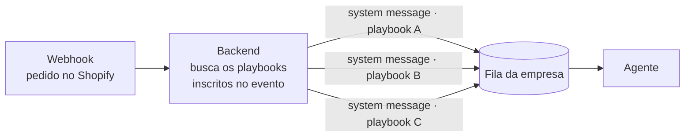

<!-- slide:capitulo -->
# Execução, agendamento e logs
<!-- /slide -->

<!-- slide:image image=assets/runs-list.png backgroundSize=contain -->
<!-- /slide -->

<!-- slide:image image=assets/runs-details.png backgroundSize=contain -->
<!-- /slide -->

<!-- slide:image image=assets/run-chat.png backgroundSize=contain -->
<!-- /slide -->

Antes de qualquer arquitetura, é isso que o cliente vê. Uma lista de **runs** com status e quando
começaram — *running*, *completed*, e a etiqueta do gatilho que a disparou. Uma run aberta mostra
o desfecho, a duração, os passos executados um a um com o tempo de cada um, e o playbook de onde
ela veio. E, no chat, a mesma execução aparece como uma linha discreta — *"Running playbook Daily
Inbox Briefing"* — em vez do XML que a disparou.

Registro por execução não é enfeite de observabilidade: é a única resposta possível para "o que
o agente fez às 3h da manhã, e por quê". Log de container não responde, porque a pergunta não é
onde quebrou — é o que ele estava tentando fazer.

<!-- slide -->
## Três gatilhos, um mecanismo

| Gatilho | Quem dispara | O que chega no agente |
| --- | --- | --- |
| **Run** | usuário clica no playbook | system message |
| **Schedule** | agendador, via `schedule_update` | system message |
| **Webhook** | evento externo (pedido no Shopify, novo lead…) | system message + payload |

*Mesma fila, mesmo sidecar, mesmo channel do chat.*
<!-- /slide -->

<!-- slide -->
## A system message é um XML

```xml
<system-message type="run-playbook"
                playbook-name="Daily Inbox Briefing"
                playbook-id="cmp5n27u3…">
Run the playbook Daily Inbox Briefing now
</system-message>
```

- Vai pelo mesmo `POST /message` que uma mensagem digitada
- O `type` diz o que é: `run-playbook`, `schedule-playbook`, `stop-run`…
- A interface reconhece o envelope e mostra *"Running playbook X"*, não o XML
<!-- /slide -->

O envelope é literalmente esse: uma tag `<system-message>` com o tipo no atributo, o playbook
identificado por nome e id, e a instrução em inglês no corpo. Quem clica em "Run" no front-end
não chama um endpoint de execução — monta esse XML e o posta no mesmo `POST /message` do chat.
O agendador e o webhook fazem o mesmo, com outro `type` e, no caso do webhook, o payload do
evento no corpo.

Duas consequências. A primeira é que não existe um segundo caminho para manter: quem sabe
entregar mensagem ao agente é o sidecar, e ele não distingue humano de cron. A segunda é de
interface: como o XML entra no chat como uma mensagem qualquer, o front-end precisa reconhecer o
envelope para não mostrar tag ao usuário — ele troca o bloco por uma linha discreta, *"Running
playbook Daily Inbox Briefing"*.

Um playbook precisa poder ser executado de três formas: à mão, no relógio e em reação a um evento
de fora. A tentação é construir três subsistemas. Nós construímos um: todos os gatilhos produzem
uma **system message** — uma mensagem que não veio de um humano, mas que entra pelo mesmo channel
e é processada pelo mesmo agente.

Isso significa que o agente não distingue "o usuário pediu" de "o cron pediu" na infraestrutura;
a distinção está no conteúdo da mensagem e no contexto que ela carrega (qual playbook, qual
gatilho, qual payload). Toda a máquina de fila, sidecar e callbacks descrita na seção do chat é
reaproveitada sem uma linha nova.

<!-- slide:image image=assets/run-schedule.png backgroundSize=contain -->
<!-- /slide -->

<!-- slide -->
## O agendamento é um evento como outro qualquer

- O schedule é salvo no backend, junto com o playbook
- Alterou o horário → evento `schedule_update` → sidecar de materialização atualiza o agente
- Na hora certa, o backend publica a system message na fila da empresa
- O agente não tem cron. Ele tem uma fila.
<!-- /slide -->

<!-- slide -->
## O schedule ativo é um JSON no disco do agente

```json
// ~/.openclaw/cron/jobs.json — cache; a verdade está no banco
{
  "jobs": [
    {
      "id": "job_7f3a",
      "name": "playbook-schedule:sch_9012",
      "schedule": { "tz": "America/New_York" }
    }
  ]
}
```

- Um job por schedule **ativo**, com o id do schedule no nome
- A materialização apaga só `playbook-schedule:*` e recria a partir do banco
- Escrever o arquivo à mão não funciona: só a CLI do agente é honrada
<!-- /slide -->

O nome do job é a chave de tudo: `playbook-schedule:<id>` é o namespace que a materialização
pode apagar sem risco. Um job fora desse prefixo — uma execução única agendada, por exemplo —
sobrevive à reconciliação, porque ela não sabe recriá-lo.

E vale a cicatriz: na v0 escrevemos esse arquivo direto no disco. As entradas apareciam no JSON
e nunca disparavam, porque quem lê o arquivo é o processo que também o escreve. A integração
suportada é a CLI (`cron create --name … --cron … --tz … --message …`), e a lição é a mesma da
materialização de playbooks: um dono por arquivo.

<!-- slide:image image=assets/run-webhooks-list.png backgroundSize=contain -->
<!-- /slide -->

<!-- slide:image image=assets/run-webhooks-new.png backgroundSize=contain -->
<!-- /slide -->

<!-- slide:image image=assets/run-webhook-details.png backgroundSize=contain -->
<!-- /slide -->

Onde vive o relógio é a decisão fina desta seção. O **schedule** é um registro no banco, criado
pela interface ou pelo próprio agente — nome, frequência, hora, timezone, data de início e
condição de parada, tudo com histórico e permissão. O que **dispara** na hora marcada é o cron do
próprio agente, e ele é derivado desse registro: no boot do container e a cada mudança publicada
pelo backend, a materialização apaga os jobs `playbook-schedule:*` e recria um por schedule ativo.

O preço dessa divisão é conhecido e vale dizer em voz alta: container fora do ar na hora marcada
não tem catch-up — a próxima reconciliação repõe os jobs, não as execuções perdidas. Em troca,
quem edita um horário na interface não depende de deploy nenhum: o evento chega, o sidecar
reconcilia, e o próximo disparo já é o novo.

Webhooks são o terceiro gatilho, e o mais interessante da lista, porque um evento pode acionar
**vários** playbooks. Cada webhook tem uma URL própria e uma lista de playbooks conectados; o
backend recebe a requisição, resolve essa lista e emite uma system message para cada um, com o
payload do evento no corpo. O agente recebe "chegou um pedido novo, aqui está o JSON, execute o
playbook X" — uma vez por inscrição.

<!-- slide -->
## Um webhook, um playbook por inscrição


<!-- /slide -->

Somando os três gatilhos: uma fila, um sidecar, um channel e um envelope de mensagem. Nenhum
executor de playbook, nenhum worker dedicado, nenhum segundo caminho para manter em pé.
