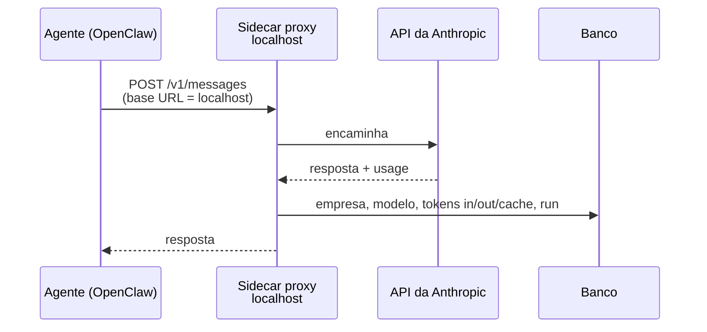

<!-- slide:capitulo -->
# Cobrança
<!-- /slide -->

<!-- slide:image image=assets/billing-usage.png backgroundSize=contain -->
<!-- /slide -->

<!-- slide -->
## Usamos mais um sidecar

<!-- /slide -->

Com chat, deploy, skills, conexões e execução no lugar, o agente fazia trabalho real entre
ferramentas diferentes. Faltava o que separa projeto de produto: saber quanto cada empresa gastou
e cobrar por isso.

Quando começamos, as soluções prontas para isso não existiam. O Token Billing da Stripe entrou em
preview privado em março de 2026; os Agent Cards da Ramp foram anunciados na mesma semana; o
controle de gasto de tokens da Ramp veio em julho. Então fizemos o que já tínhamos feito três
vezes: colocamos um processo ao lado.

<!-- slide -->
## O agente não sabe que está sendo medido

*Config injetada no deploy: a base URL da Anthropic aponta para `localhost`. Zero mudança no agente.*
<!-- /slide -->

O OpenClaw aceita configurar a URL base do provedor. A task de deploy injeta uma configuração
que aponta a Anthropic para `localhost`, onde o sidecar de billing escuta. Containers da mesma
task ECS compartilham a interface de rede, então `localhost` funciona sem nenhuma exposição.

O proxy encaminha a requisição, lê o bloco de `usage` da resposta e grava no banco: empresa,
usuário, modelo, tokens de entrada, de saída e de cache, e a run à qual aquela chamada pertence.
Cada interação vira uma linha. O agente nem sabe.

<!-- slide -->
## De token a dólar

- **Tabela de preços** por modelo, atualizada **uma vez por semana**
- Custo = tokens × preço do modelo, por interação
- **Markup** em cima do custo
- Mostrado em **dólares**, por empresa, por playbook, por run

***

*Token não significa nada para quem compra. Dólar significa.*
<!-- /slide -->

<!-- slide:image image=assets/billing-manage.png backgroundSize=contain -->
<!-- /slide -->

<!-- slide:image image=assets/billing-stripe.png backgroundSize=contain -->
<!-- /slide -->

A conta é simples de propósito. Mantemos uma tabela com o preço por milhão de tokens de cada
modelo que usamos, atualizada uma vez por semana a partir da página de preços do provedor.
Multiplicamos, aplicamos um markup e pronto. Não há rateio complicado nem estimativa: cada linha
do banco tem o custo exato daquela chamada.

A decisão de produto mais importante aqui foi a unidade. Usuários não técnicos não têm intuição
sobre o que são 40 mil tokens de entrada e 3 mil de saída, e a razão de preço entre entrada e
saída (na Anthropic, hoje, 1:5) torna qualquer contagem bruta enganosa. Dólar, por playbook e por
run, é a única unidade que faz sentido para quem paga — e, como o custo está amarrado à run,
também é a resposta para "quanto custou o relatório de segunda-feira?".

O que a gente faria diferente hoje? Provavelmente avaliaria o Token Billing da Stripe, que faz
exatamente isso — sincroniza os preços dos provedores e aplica o seu markup — em cima do
Metronome, que a Stripe comprou em janeiro de 2026. Mas o proxy continua existindo de qualquer
forma: é ele que amarra a chamada à run, e isso a Stripe não sabe fazer.
