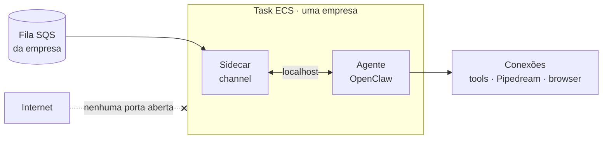

<!-- slide:capitulo -->
# Segurança
<!-- /slide -->

<!-- slide -->
## O que entra e o que sai do agente

<!-- /slide -->

Vale olhar o desenho pelas setas que **não** existem. Não há seta da internet para dentro da
task: o agente não escuta em porta nenhuma, e a única entrada é a fila da própria empresa, lida
pelo sidecar e entregue por `localhost`. Do outro lado ficam as conexões — as tools internas, o
Pipedream e o browser —, que são também a superfície por onde texto de fora entra. Duas vias, as
duas nossas, e é sobre elas que o resto da seção fala.

<!-- slide -->
## Fechado por padrão

- Sem endpoint público (já vimos)
- Sem acesso direto ao file system do agente
- Sem download de arquivo pelo usuário
- Credenciais entram pela task de deploy; o usuário nunca as vê

***

*"Mas eu pedi um CSV e ele fez o CSV. Como eu baixo?"*
<!-- /slide -->

Quando alguém pede ao agente "um CSV com os 20 produtos mais vendidos no Shopify este mês", o
arquivo é gerado e pode até ficar salvo no disco do agente. Mas **o usuário não consegue baixar
esse arquivo**. Não há rota para isso.

Parece limitação. É decisão de produto que coincide com a de segurança. O objetivo do agente é
automatizar **processos** — coisas que vão se repetir. Um processo repetível não termina com
um download em um laptop; termina publicando o resultado em algum lugar: um step do playbook que
manda o CSV para um Google Drive, para um canal do Slack, para um e-mail.

<!-- slide -->
## O agente é um usuário, não um servidor

- Ele tem credenciais das conexões da empresa → trate como um funcionário com acesso
- Ele lê texto de fora (páginas, e-mails, payloads de webhook) → esse texto pode conter instruções
- Autorização fica **na camada que executa a ferramenta**, não na decisão do modelo
- Isolamento por empresa é físico: um serviço, um volume, uma fila
<!-- /slide -->

O agente consome texto de fontes que não controlamos: uma página que o Playwright abriu, o corpo
de um e-mail, o payload de um webhook. Esse texto pode conter instruções, e um modelo não tem
como distinguir com certeza "dado" de "comando". A consequência arquitetural é que a autorização
não pode depender do que o modelo decidiu fazer. Ela precisa estar onde a ferramenta executa,
avaliando a identidade da empresa e do playbook, não a intenção declarada.

É a lição do SQL injection com outra roupa: nunca deixe o dado virar comando. E a resposta é a
mesma de sempre — reduzir superfície (sem endpoint, sem download), separar credenciais do código
(task de deploy), e isolar tenants por construção (um serviço por empresa) em vez de por
convenção.
