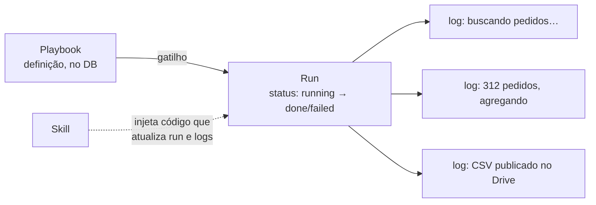

<!-- slide:capitulo -->
# A tese
<!-- /slide -->

## A pergunta que quebra tudo

> "Por que o agente fez isso?"

Log de container não responde. Métrica não responde.

Responde quem tem um **registro por execução**, com o que aconteceu em cada passo.

Em software determinístico, entrada mais código explicam a saída; basta saber onde quebrou. Com
um modelo no meio, a mesma entrada produz saídas diferentes, e "onde quebrou" deixa de bastar.
O que o cliente quer saber é o que o agente estava tentando fazer quando fez aquilo.

## Playbook → run → logs

Além de playbooks, o banco tem o conceito de **run**: uma execução de um playbook, com status e
timestamps. Cada run tem **logs** que vão sendo acrescentados enquanto o agente trabalha.

O truque está em quem escreve esses logs. As skills que materializamos no agente carregam trechos
de código que chamam o backend para atualizar o status da run e registrar o que está acontecendo.
Ou seja: a observabilidade não é um observador externo tentando inferir o que o agente faz — é
o próprio playbook, por construção, reportando os passos. A skill é ao mesmo tempo instrução e
instrumentação.

Auditoria e observabilidade são o mesmo dado com exigências diferentes: retenção longa, acesso
por quem não é engenheiro, e a capacidade de reconstituir uma execução depois que o container que
a rodou já não existe. Por isso nada de importante mora só no agente. O que está no disco do
OpenClaw é memória de trabalho; o que está no banco é o registro.
